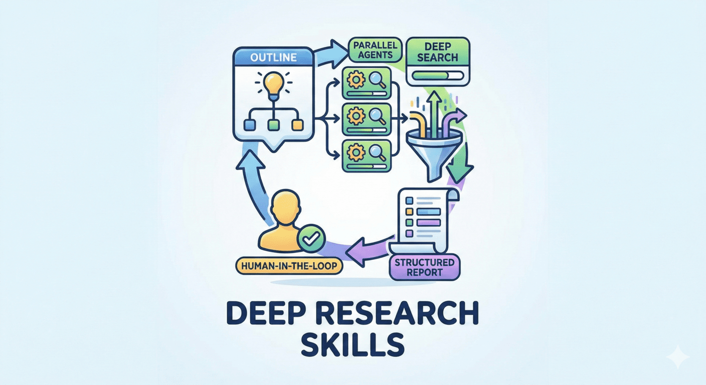

# Investment Research Skill for Claude Code / OpenCode / Codex

[English](README.md) | [中文](README.zh.md)

> 如果这个项目对你有帮助，欢迎点个 star。
>
> 本仓库是基于 [Deep-Research-skills](https://github.com/Weizhena/Deep-Research-skills) 面向投资研究场景的改写版本。感谢原仓库提供的工作流设计、结构和起点。
>
> 灵感来源：[RhinoInsight: Improving Deep Research through Control Mechanisms for Model Behavior and Context](https://arxiv.org/abs/2511.18743)

这个仓库现在在每个平台/语言包里只保留一个主 skill：`invest_reasearch`。内部仍然保留 outline、模块分析、结构化 JSON、最终报告这些阶段，但用户不需要再在 `research-deep` 和 `research-report` 之间来回切换。



## 这个 Skill 能做什么

`invest_reasearch` 用于对单一上市公司或股票做端到端投资研究：

- 理解商业模式、护城河和行业结构
- 评估 ROIC、现金流质量和增长持续性
- 判断市场一致预期和潜在预期差
- 形成 Bear / Base / Bull 情景
- 产出结构化 JSON 和最终投资备忘录

## 典型产出

运行后通常会生成：

- `outline.yaml`：研究范围、核心问题和执行配置
- `fields.yaml`：研究字段定义
- `module-results/*.md`：行业、护城河、财务、增长、预期、估值、风险等模块笔记
- `results/{company}.json`：结构化研究结果
- `report.md`：最终投资决策备忘录

## 安装

克隆当前仓库或你自己的 fork：

```bash
git clone <this-repo-or-your-fork-url> Investment-Research-skill
cd Investment-Research-skill
```

### Claude Code

```bash
# 中文版
cp -r skills/research-zh/* ~/.claude/skills/

# 英文版
cp -r skills/research-en/* ~/.claude/skills/

# 必需：安装 web search agent 和模块
cp agents/web-search-agent.md ~/.claude/agents/
cp -r agents/web-search-modules ~/.claude/agents/

# 必需：安装 Python 依赖
pip install pyyaml
```

### OpenCode（默认 gpt-5.4）

```bash
# Skills
cp -r skills/research-zh/* ~/.claude/skills/   # 或者使用 research-en 英文版

# 必需：为当前 shell 启用 web search
export OPENCODE_ENABLE_EXA=1

# 可选：写入 ~/.bashrc，永久生效
echo 'export OPENCODE_ENABLE_EXA=1' >> ~/.bashrc
source ~/.bashrc

# 必需：安装 web search agent 和模块
cp agents/web-search-opencode.md ~/.config/opencode/agents/web-search.md
cp -r agents/web-search-modules ~/.config/opencode/agents/

# 必需：安装 Python 依赖
pip install pyyaml
```

> **重要**：在 OpenCode 中，要使用 web search，需要设置 `OPENCODE_ENABLE_EXA=1`。单纯 `export` 只对当前 shell 生效，写入 `~/.bashrc` 后才会长期生效。如果不设置，就只能使用 `web fetch`，对于证据搜集和多来源交叉验证会明显不够。

### Codex

```bash
# 英文版
mkdir -p ~/.codex/skills ~/.codex/agents
cp -r skills/research-codex-en/* ~/.codex/skills/

# 中文版
mkdir -p ~/.codex/skills ~/.codex/agents
cp -r skills/research-codex-zh/* ~/.codex/skills/

# 必需：安装 web researcher agent 和模块
cp agents-codex/web-researcher.toml ~/.codex/agents/
cp -r agents-codex/web-search-modules ~/.codex/agents/

# 必需：安装 Python 依赖
pip install pyyaml
```

使用下面任一方式更新 `~/.codex/config.toml`。

**方式 A：自动脚本**

```bash
cd Investment-Research-skill
bash scripts/install-codex.sh
```

**方式 B：手动编辑**

```toml
suppress_unstable_features_warning = true

[features]
multi_agent = true
default_mode_request_user_input = true

[agents.web_researcher]
description = "Use this agent when you need internet research for investment work, such as company analysis, industry mapping, regulatory checks, transcript collection, or gathering evidence from multiple public sources. Use it when you need creative search strategies, broad source coverage, and organized findings."
config_file = "agents/web-researcher.toml"
```

## 命令

> **Claude Code 2.1.0+**：支持直接用 `/skill-name` 触发。
>
> **旧版本**：请使用 `run /skill-name`。
>
> **Codex**：你可以从 `/skills` -> `List Skills` 里触发，也可以直接自然语言说明，例如 `Use the invest_reasearch skill to research NVIDIA`。

| 命令 | 作用 |
|------|------|
| `/invest_reasearch` | 一次完成完整工作流：确定研究范围、搜集证据、模块分析、JSON 校验、生成最终备忘录 |

## 使用示例

```text
/invest_reasearch 腾讯控股
```

对于 Codex，也可以这样说：

```text
Use the invest_reasearch skill to research Tencent and give me a final investment view
```

默认情况下，这个 skill 会：

1. 生成或刷新研究计划
2. 收集证据并输出模块笔记
3. 合并结构化 JSON 结果
4. 生成最终投资备忘录

如果你只想停在中间产物，请显式说明，例如：“先停在 outline.yaml”。

## 输出结构

```text
{working-directory}/{company_slug}/
  outline.yaml
  fields.yaml
  module-results/
  results/{target_company_slug}.json
  generate_report.py   # 可选
  report.md
```

## 为什么会有这个仓库

这个仓库是对 `Deep-Research-skills` 的延续式改写，但明确把流程朝这些方向推进：

- 公司和股票研究
- 投资导向的证据收集
- 预期差分析
- 估值与回报框架
- 最终投资备忘录生成

它不是假装和上游无关，而是明确站在原项目基础上继续演进。

## 需要帮助？

你可以直接这样问：

```text
帮我理解这个投资研究 skill 项目，以及它是如何工作的
```

## 致谢

- [Deep-Research-skills](https://github.com/Weizhena/Deep-Research-skills)
- [RhinoInsight: Improving Deep Research through Control Mechanisms for Model Behavior and Context](https://arxiv.org/abs/2511.18743)

## 许可协议

MIT
